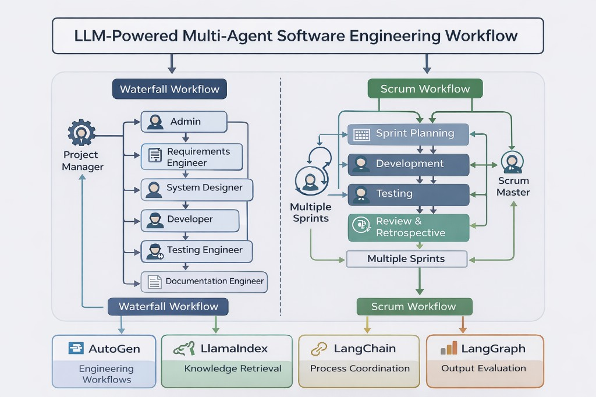

# LLM-Powered Multi-Agent Software Engineering Workflow


A multi-agent system that simulates software development lifecycle (SDLC) processes using AI agents. This project demonstrates how LLM-powered agents can collaborate to generate requirements, system designs, implementation plans, test cases, and documentation.



## Features

- **Multi-Agent Collaboration**: 6+ AI agents simulating different SDLC roles
- **Methodology Support**: Both Waterfall and Scrum workflow implementations
- **Framework Comparison**: Benchmarking of 4 major LLM orchestration frameworks
- **Automated Planning**: End-to-end software project planning using AI

## Why This Project Matters

As AI continues to transform software development, understanding how to orchestrate multiple LLM agents becomes a critical skill. This project explores:

- **Practical Multi-Agent Design**: How to structure agent roles, responsibilities, and communication patterns
- **Framework Trade-offs**: Real-world comparison of leading LLM orchestration tools
- **Methodology Automation**: Applying AI to established SDLC methodologies (Waterfall, Scrum)
- **Reproducible Research**: Documented experiments that others can replicate and extend

Whether you're building AI-powered dev tools, researching agent collaboration, or evaluating frameworks for your team, this project provides hands-on examples and benchmarks.

## Agents Implemented

| Agent Role                 | Responsibility                                              |
| -------------------------- | ----------------------------------------------------------- |
| **Product Owner**          | Manages product backlog, prioritizes features               |
| **Scrum Master**           | Facilitates sprints, removes impediments                    |
| **Requirements Engineer**  | Documents functional/non-functional requirements            |
| **System Designer**        | Creates architecture diagrams, database schemas, UI mockups |
| **Developer**              | Writes implementation code and technical specifications     |
| **Test Engineer**          | Develops test cases, performs validation                    |
| **Documentation Engineer** | Compiles user manuals and API documentation                 |

## Frameworks Compared

| Framework                                              | Use Case                  | SLOC Output | Test Cases |
| ------------------------------------------------------ | ------------------------- | ----------- | ---------- |
| [AutoGen](https://github.com/microsoft/autogen)        | Multi-agent conversations | 350         | 6          |
| [LlamaIndex](https://github.com/run-llama/llama_index) | Data-centric LLM apps     | 133         | 21         |
| [LangChain](https://github.com/langchain-ai/langchain) | General LLM applications  | 1400        | 13         |
| [LangGraph](https://github.com/langchain-ai/langgraph) | Stateful agent graphs     | 1620        | 24         |

> _Metrics are based on generated artifacts from each framework notebook run. See [Comparative Analysis](docs/COMPARATIVE_ANALYSIS.md) for methodology and detailed results._

## Project Structure

```
llm-multi-agent-se-workflow/
├── README.md
├── requirements.txt
├── .env.example
├── .gitignore
├── phase1-waterfall/
│   └── waterfall_multi_agent.ipynb    # Waterfall methodology with AutoGen
├── phase2-scrum/
│   ├── autogen.ipynb      # AutoGen Scrum implementation
│   ├── llamaindex.ipynb   # LlamaIndex Scrum implementation
│   ├── langchain.ipynb    # LangChain Scrum implementation
│   └── langgraph.ipynb    # LangGraph Scrum implementation
├── outputs/                   # Sample outputs from AI agents
│   ├── phase1-waterfall/      # Waterfall workflow outputs
│   └── phase2-scrum/          # Scrum workflow outputs
└── docs/
    ├── workflow_diagram.png
    └── COMPARATIVE_ANALYSIS.md
```

## Quick Start

### Prerequisites

- Python 3.10+
- OpenAI API key

### Installation

1. **Clone the repository**

   ```bash
   git clone https://github.com/Jivan2801/LLM-Powered-Multi-Agent-Software-Engineering-Workflow.git
   cd LLM-Powered-Multi-Agent-Software-Engineering-Workflow
   ```

2. **Create virtual environment**

   ```bash
   python -m venv venv
   source venv/bin/activate  # On Windows: venv\Scripts\activate
   ```

3. **Install dependencies**

   ```bash
   pip install -r requirements.txt
   ```

4. **Configure API key**
   ```bash
   cp .env.example .env
   # Edit .env and add your OpenAI API key
   ```

### Running the Notebooks

1. **Start Jupyter**

   ```bash
   jupyter notebook
   ```

2. **Run Phase 1** (Waterfall with AutoGen)
   - Open `phase1-waterfall/waterfall_multi_agent.ipynb`
   - Run all cells to see the multi-agent workflow in action

3. **Run Phase 2** (Framework Comparison - Scrum)
   - Open any notebook in `phase2-scrum/`
   - Compare outputs across different frameworks

## Example Output

When you run the Waterfall workflow, the agents collaborate to produce:

```
=== REQUIREMENTS PHASE ===
- User Authentication (login, registration, password recovery)
- Book Browsing (by genre, search, filters)
- Book Previews (sample chapters)
- Online Purchase (cart, payment gateway)
- Shipment Tracking (order status)
- Book Reviews (ratings, comments)
- Personalized Recommendations (ML-based suggestions)

=== DESIGN PHASE ===
- System Architecture Diagram
- Database Schema (Users, Books, Orders, Reviews)
- API Endpoints Design
- UI/UX Mockups

=== IMPLEMENTATION PHASE ===
- API endpoint specifications
- Code structure recommendations
- Integration guidelines

=== TESTING PHASE ===
- Unit test cases
- Integration test scenarios
- UAT criteria

=== DOCUMENTATION PHASE ===
- API documentation
- Deployment guide
- User manual outline
```

> **See actual AI-generated outputs**: Check the [`outputs/`](outputs/) folder for real agent conversation logs and generated artifacts from both Waterfall and Scrum workflows.

## Use Cases

This project demonstrates applications for:

- **AI-Assisted Project Planning**: Automate initial project scoping
- **Requirements Generation**: Use AI to brainstorm comprehensive requirements
- **Framework Evaluation**: Compare LLM frameworks for your use case
- **Educational Purposes**: Learn about multi-agent systems and LLM orchestration

## Technologies Used

- **Python 3.10+**
- **OpenAI GPT models** (configurable via `.env`)
- **AutoGen** - Microsoft's multi-agent framework
- **LlamaIndex** - Data framework for LLM applications
- **LangChain** - LLM application development framework
- **LangGraph** - Stateful agent orchestration

## Contributing

Contributions are welcome! Please feel free to submit a Pull Request.

1. Fork the repository
2. Create your feature branch (`git checkout -b feature/AmazingFeature`)
3. Commit your changes (`git commit -m 'Add some AmazingFeature'`)
4. Push to the branch (`git push origin feature/AmazingFeature`)
5. Open a Pull Request

## Acknowledgments

- OpenAI for GPT models
- Microsoft for AutoGen framework
- LlamaIndex and LangChain teams for their excellent frameworks

## License

This project is open source and available for educational and research purposes.
